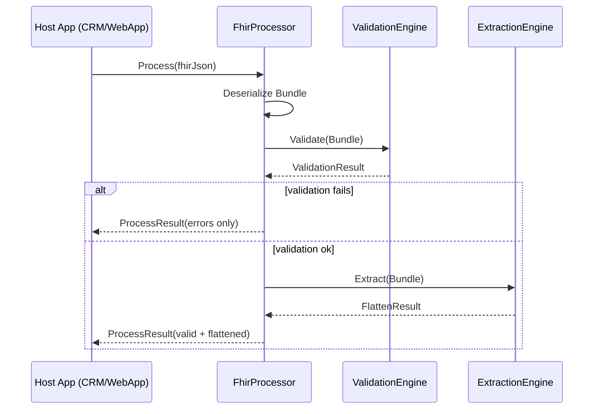

# 02 — System Architecture
## PSS FHIR Processor — Validation & Extraction Engine  
Version 1.0

---

# 1. Architectural Overview

The architecture consists of **three major components** packaged in a single Git repository:

1. **PSS FHIR Processor DLL**  
   A standalone class library implementing:
   - Validation Engine  
   - Extraction Engine  
   - Public Facade API  
   - FHIR models  
   - Flattened models  
   - Codes Master & RuleSet models  

2. **PSS FhirPlayground WebApp**  
   An ASP.NET MVC application serving as:
   - Playground UI
   - JSON testing console
   - Automated test runner  
   - Developer/demo tool  
   - No database, no filesystem dependencies  

3. **PSS FhirProcessor Unit Tests**  
   Automated test suite:
   - Validation scenarios  
   - Extraction scenarios  
   - End-to-end processing  
   - Codes Master + RuleSet integrity tests  

---

# 2. High-Level Solution Diagram

```mermaid
flowchart TB

subgraph A[PSS FHIR Processor DLL]
  V[Validation Engine]
  X[Extraction Engine]
  F[Facade API: FhirProcessor]
  M[Models (FHIR + Flattened)]
  C[Codes Master & RuleSets]
end

subgraph B[PSS WebApp Playground]
  UI[Playground UI & Test Runner]
  SC[Seeded Metadata: Rules, Codes, Tests]
end

subgraph C[Unit Tests]
  UT[Validation Tests]
  ET[Extraction Tests]
  E2E[E2E Tests via FhirProcessor]
end

UI --> F
SC --> UI
F --> V
F --> X
V --> F
X --> F

UT --> F
ET --> F
E2E --> F
```

---

# 3. Architectural Principles

## 3.1 Metadata-Driven (No Hardcoding)
All validation logic is provided through:

- RuleSets JSON (per scope)
- Codes Master JSON

The DLL never hardcodes question logic.

## 3.2 Strict Resource Requirements
The system **always expects**:
- Patient  
- Encounter  
- Location  
- HealthcareService  
- Provider Organization  
- Cluster Organization  
- HS Observation  
- OS Observation  
- VS Observation  

Missing any → Validation error.

## 3.3 No Environment Dependencies
All host systems must pass in:
- RuleSets JSON  
- Codes Master JSON  
- Validation Options  
- Logging Options  

## 3.4 FHIR Model Minimalism
Models include only fields needed for validation + extraction.

## 3.5 Fully Isolated WebApp
WebApp is:
- DB-less  
- File-less  
- Seeded in memory  
- For: vendor testing, developer debugging, QA testing, demos.

---

# 4. Component Architecture

## 4.1 FhirProcessor (Facade Layer)
Coordinates engines and exposes public API:

```
LoadRuleSets()
LoadCodesMaster()
SetValidationOptions()
SetLoggingOptions()
Process(json)
```

## 4.2 Validation Engine
Validates:
- Required resources
- Screening types HS/OS/VS
- Mandatory fields
- Fixed values
- Fixed codings
- Codes Master rules
- PureTone multi-values
- Conditional dependencies

Error codes:
- RESOURCE_MISSING  
- MISSING_SCREENING_TYPE  
- MANDATORY_MISSING  
- UNKNOWN_QUESTION_CODE  
- QUESTION_DISPLAY_MISMATCH  
- INVALID_ANSWER_VALUE  
- INVALID_MULTI_VALUE  
- FIXED_VALUE_MISMATCH  
- FIXED_CODING_MISMATCH  
- CONDITIONAL_FAILED  

## 4.3 Extraction Engine
Converts Bundle → FlattenResult:
- Extract EventData  
- Extract ParticipantData  
- Extract HS/OS/VS Observation components  
- Build ObservationItem  
- Multi-value splitting  

## 4.4 Models
Groups:
- FHIR (minimal)
- Flattened (EventData, ParticipantData, ScreeningSet)
- Validation (RuleSet, ValidationRule, ValidationError, ValidationOptions)
- Codes Master
- Common (CodeDisplayValue)

## 4.5 WebApp Architecture
Components:
- Controllers
- Razor Views
- In-memory seeds for rules, codes, test cases

Features:
- JSON editor  
- Toggle validation options  
- Test runner  

---

# 5. Repository Layout

```
pss-fhir-processor/
│
├── docs/
│   ├── 01-overview.md
│   ├── 02-architecture.md
│   ├── ...
│   ├── 13-appendix.md
│   └── pss-fhir-processor-design.md (combined)
│
├── src/
│   ├── MOH.HealthierSG.PSS.FhirProcessor/
│   ├── PSS.FhirPlayground.Web/
│   └── PSS.FhirProcessor.Tests/
│
├── prompts/
├── samples/
└── TODO.md
```

---

# 6. Sequence Diagram



---

# 7. Deployment Architecture

WebApp:
- Deployed to IIS or Azure App Service
- No external dependencies

DLL:
- Deployed with CRM plugins or other .NET hosts

---

# 8. Error Handling Architecture

- Validation errors as structured list  
- Exceptions only for system failures  
- Logs contained in ProcessResult  

---

# 9. Extensibility

Supports:
- Future additional RuleSets  
- Versioned codes master  
- Tenant-specific validation  
- Additional screening types  

---

# 10. Summary

Architecture is:
- Clean  
- Extensible  
- Metadata-driven  
- CRM-agnostic  
- Testable  
- Suitable for WebApp, CRM, and automation  
