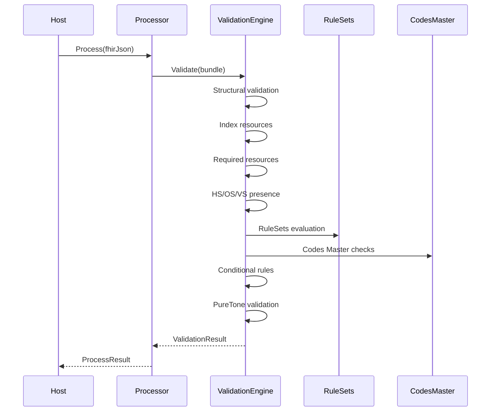

# 05 — Validation Engine Design
PSS FHIR Processor — Validation Framework  
Version 1.0 — 2025

---

# 1. Introduction

The Validation Engine ensures every incoming `put-screening` FHIR Bundle follows:

- Structural FHIR requirements  
- PSS integration specifications  
- Screening-type requirements (HS/OS/VS)  
- Codes Master rules (question code, display, allowed answers)  
- PureTone multi-value logic  
- Conditional business rules  
- Fixed-value and fixed-coding constraints  
- Mandatory rules per screening type  

The Validation Engine is:
- Metadata-driven  
- CRM-agnostic  
- Deterministic  
- Non-throwing for data errors  
- Host-independent  

Passing validation proceeds to extraction. Failing validation returns errors.

---

# 2. Architectural Principles

## 2.1 Metadata-Driven
All validation logic comes from:
- RuleSets JSON  
- Codes Master JSON  
- ValidationOptions  
- LoggingOptions  

## 2.2 Deterministic Execution
Validation always executes:
1. Structure checks  
2. Resource indexing  
3. Required resource validation  
4. Screening type checks  
5. RuleSets evaluation  
6. Codes Master validation  
7. Conditional logic  
8. PureTone logic  
9. Aggregate errors  

## 2.3 No External Dependencies
The engine:
- Does not read files  
- Does not access databases  
- Does not use network calls  

## 2.4 Non-Throwing
Validation errors returned as `ValidationError`.

---

# 3. Public API

```csharp
public class ValidationEngine
{
    public void LoadRuleSets(Dictionary<string, string> jsonByScope);
    public void LoadCodesMaster(string json);
    public void SetOptions(ValidationOptions options);
    public ValidationResult Validate(Bundle bundle);
}
```

---

# 4. RuleSets Structure

RuleSets grouped by scope:
- Event
- Participant
- HS
- OS
- VS

Each RuleSet contains:
```json
{
  "Scope": "HS",
  "Rules": [ ... ]
}
```

---

# 5. Codes Master Structure

Each entry contains:
- QuestionCode  
- QuestionDisplay  
- ScreeningType  
- AllowedAnswers[]  

Used to validate question display & answer values.

---

# 6. Validation Workflow

```
Validate(Bundle)
  1. Structural validation
  2. Index all resources
  3. Validate required resources
  4. Validate HS/OS/VS presence
  5. Apply RuleSets
  6. Validate Codes Master
  7. Validate conditional rules
  8. Validate PureTone answers
  9. Return ValidationResult
```

---

# 7. Resource Indexing

Resources indexed by:
```
Dictionary<string, List<Resource>>
```

Examples:
- "Patient"
- "Encounter"
- "Observation:HS"

---

# 8. Rule Types

## 8.1 Required Rule
Ensures field exists.  
Error: `MANDATORY_MISSING`

## 8.2 FixedValue Rule
Ensures literal value matches.  
Error: `FIXED_VALUE_MISMATCH`

## 8.3 FixedCoding Rule
Validates coding.system & coding.code.  
Error: `FIXED_CODING_MISMATCH`

## 8.4 AllowedValues Rule
Simple answer lists.  
Error: `INVALID_ANSWER_VALUE`

## 8.5 CodesMaster Rule
Validates:
- Question code
- Display text
- Answer values  
Errors:
- `UNKNOWN_QUESTION_CODE`
- `QUESTION_DISPLAY_MISMATCH`
- `INVALID_ANSWER_VALUE`
- `INVALID_MULTI_VALUE`
- `INVALID_SCREENING_TYPE_FOR_QUESTION`

## 8.6 Conditional Rule
Implements "if X then Y" logic with two modes:

**JSONPath Mode** (for general path-based conditions):
```json
{
  "RuleType": "Conditional",
  "If": "Entry[0].Resource.Status",
  "Then": "Entry[0].Resource.ActualPeriod"
}
```

**Component Mode** (for question code-based conditions with value checking):
```json
{
  "RuleType": "Conditional",
  "If": "SQ-L2H9-00000001",
  "WhenValue": "Yes",
  "Then": "SQ-L2H9-00000003"
}
```

The `WhenValue` property enables value-based conditional logic:
- If `WhenValue` is specified, the condition only triggers when the field has that specific value
- If `WhenValue` is omitted, the condition triggers whenever the field exists

Error: `CONDITIONAL_FAILED`

---

# 9. Screening Type Requirements

Every bundle must include:
- HS Observation  
- OS Observation  
- VS Observation  

Missing any → `MISSING_SCREENING_TYPE`

---

# 10. Question & Answer Validation

## 10.1 Code Validation
If code not found → `UNKNOWN_QUESTION_CODE`

## 10.2 Display Validation
Strict or normalized.  
Mismatch → `QUESTION_DISPLAY_MISMATCH`

## 10.3 Answer Validation
Single-value answers must match AllowedAnswers.  
Invalid → `INVALID_ANSWER_VALUE`

---

# 11. Multi-Value (PureTone) Validation

Multi-value example:
```
500Hz – R|1000Hz – NR
```

Validation:
1. Split by "|"
2. Trim
3. Validate against allowed list  

Invalid → `INVALID_MULTI_VALUE`

---
# 12. Conditional Logic

Supports rules like:
- If screening skipped → PureTone must not appear  
- If answer Yes → additional questions required  

Failure → `CONDITIONAL_FAILED`

---

# 13. No Extra Questions

If question code not in Codes Master:
```
UNKNOWN_QUESTION_CODE
```

If placed in wrong screening type:
```
INVALID_SCREENING_TYPE_FOR_QUESTION
```

---

# 14. ValidationResult Model

```csharp
public class ValidationResult
{
    public bool IsValid { get; set; }
    public List<ValidationError> Errors { get; set; }
}
```

---

# 15. ValidationError Model

```csharp
public class ValidationError
{
    public string Code { get; set; }
    public string FieldPath { get; set; }
    public string Message { get; set; }
    public string Scope { get; set; }
}
```

---

# 16. Logging Options

```csharp
public class LoggingOptions
{
    public string LogLevel { get; set; } // info | debug | verbose
}
```

Verbose logs all rule evaluations.

---

# 17. Path Resolver Specification

Supports:
- Dot navigation  
- Array index `[0]`  
- Wildcard `[]`  
- `coding[0]` shortcut  

Unresolved paths count as missing.

---

# 18. Pseudocode

```csharp
Validate(bundle):
    CheckStructure()
    IndexResources()
    ValidateRequired()
    ValidateScreeningTypes()
    ApplyRuleSets()
    ValidateCodesMaster()
    ValidateConditionalRules()
    ValidatePureTone()
    return ValidationResult
```

---

# 19. Sequence Diagram



---

# 20. Summary Checklist

- Metadata-driven  
- RuleSets + Codes Master  
- HS/OS/VS required  
- Question code, display, answers validated  
- PureTone multi-value supported  
- Conditional rules supported  
- Structured, non-throwing errors  
- No external dependencies  
- Identical behavior in CRM + WebApp  

---

# END OF FILE 05


